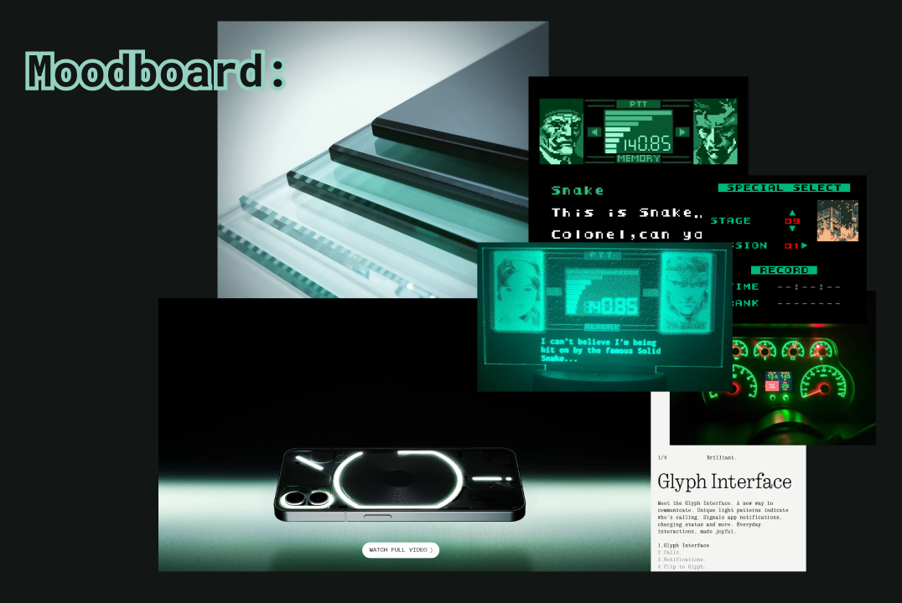

# Saadaf's Portfolio

Hello! My name is Saadaf. I hope you're well. Welcome to my portfolio repo.
 
# Identity
The aesthetic of my website. My website's design is inspired by the _Nothing_ phone's brand identity, Metal Gear Solid user interfaces, 90's electroluminescent gauge clusters, and tempered glass. Refer to the moodboard below. Additionally, I used figma to prepare designs for the website.

 

# Technologies
At the moment, this website is built with HTML, CSS, JavaScript, and Figma.
 

# UX/UI Prototype
See: https://www.figma.com/design/7uR4mGdPgJeKycjrVPPWwp/Saadafs-Portfolio?node-id=0-1&t=G0PI4pw6F72J4p0L-1

